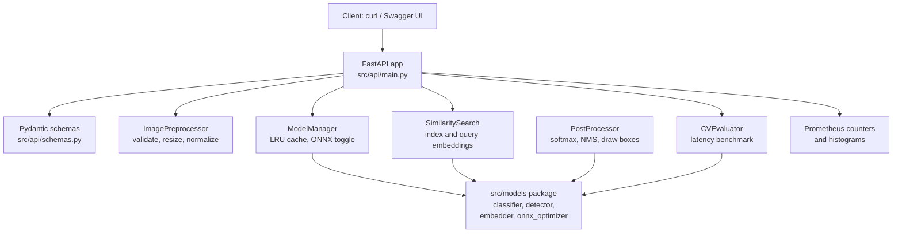

# Computer Vision API

A FastAPI service for image classification, object detection, image embeddings, and
similarity search. It is built around torchvision models served on CPU (or GPU), with an
optional ONNX backend, a small in-memory model cache, batch processing helpers, and an
evaluation module for accuracy, mean Average Precision (mAP), and latency.

## What this project does

- **Image classification.** Endpoints accept an uploaded image (or a URL, or a batch) and
  return top-k labels with confidence scores.
- **Object detection.** Endpoints return bounding boxes with labels and confidence, filtered
  by a confidence threshold.
- **Image embeddings and similarity search.** An image is turned into a vector; vectors can
  be indexed and queried for nearest neighbours.
- **Evaluation.** Compute classification accuracy and per-class precision/recall/F1, detection
  mAP (with mAP@50 and mAP@75), and latency percentiles.
- **Batch processing.** Process a directory, a list of files, or a list of URLs, with per-item
  error isolation so one bad image does not fail the batch.

## Key concepts, in plain language

- **Top-k classification.** Instead of one answer, the classifier returns the `k` most likely
  labels with probabilities. Probabilities come from a softmax over the model logits
  (`src/processing/postprocessor.py:55`).
- **Non-max suppression (NMS).** Detectors often produce several overlapping boxes for the
  same object. NMS keeps the highest-confidence box and drops others that overlap it beyond an
  IoU threshold. The post-processor calls `non_max_suppression` from the detector module
  (`src/processing/postprocessor.py:90`).
- **Mean Average Precision (mAP).** A standard detection metric. This repo computes Average
  Precision per class using 11-point interpolation, averaged over IoU thresholds 0.5 to 0.95
  in steps of 0.05 (`src/evaluation/evaluator.py:159`, `src/evaluation/evaluator.py:260`).
- **ONNX backend.** ONNX Runtime can run an exported model graph, often faster on CPU than the
  eager PyTorch path. The model manager has a code path to export and load ONNX models, gated
  by configuration (`src/serving/model_manager.py:110`). It is disabled by default
  (`src/config/settings.py:44`).
- **LRU model cache.** Loaded models are kept in an ordered dictionary; when the cache exceeds
  `MAX_LOADED_MODELS`, the least-recently-used model is evicted
  (`src/serving/model_manager.py:69`).

## Components

Each item was checked against the code. All modules import cleanly; the only runtime needs
are model weights (downloaded by torchvision on first use), an optional GPU, and the ONNX
backend (disabled by default).

| Component | File | Notes |
|-----------|------|-------|
| Image preprocessing (resize, normalize, validate, augment) | `src/processing/preprocessor.py` | Depends on torch/torchvision/PIL. |
| Batch processor (directory / files / URLs) | `src/processing/batch_processor.py` | Per-item error isolation. |
| Settings | `src/config/settings.py` | Reads `CV_`-prefixed env vars and `.env`. |
| Structured logging | `src/utils/logging.py` | structlog-based. |
| Models package (classifier, detector, embedder, ONNX optimizer) | `src/models/` | `BBox`, `compute_iou`, `non_max_suppression`, and the result dataclasses are dependency-free; the model wrapper classes build their torchvision backbones lazily so importing the package never downloads weights. |
| Evaluator (accuracy, mAP, latency) | `src/evaluation/evaluator.py` | Imports `BBox`/`compute_iou` from `src/models/detector.py`. The classification and latency logic does not need a real model. |
| Post-processor (softmax decode, NMS, draw boxes) | `src/processing/postprocessor.py` | Imports `BBox`/`non_max_suppression` from `src/models/detector.py`. |
| Model manager (load, cache, ONNX export) | `src/serving/model_manager.py` | Imports the classifier, detector, embedder, and ONNX optimizer; keeps an LRU cache of loaded models. |
| FastAPI app and all endpoints | `src/api/main.py` | Wires preprocessing, the model manager, similarity search, and the evaluator together. |

The model wrapper classes download torchvision weights on first inference and benefit from a
GPU, but the package imports without either. The ONNX backend is opt-in.

## API surface

These routes are declared in `src/api/main.py`.

| Method | Endpoint | Handler | File |
|--------|----------|---------|------|
| POST | `/api/v1/classify` | classify one uploaded image | `src/api/main.py:107` |
| POST | `/api/v1/classify/batch` | classify several uploaded images | `src/api/main.py:139` |
| POST | `/api/v1/classify/url` | classify an image fetched from a URL | `src/api/main.py:171` |
| POST | `/api/v1/detect` | object detection on one image | `src/api/main.py:195` |
| POST | `/api/v1/detect/batch` | object detection on several images | `src/api/main.py:227` |
| POST | `/api/v1/embed` | return the embedding vector of an image | `src/api/main.py:264` |
| POST | `/api/v1/index` | index an image embedding for search | `src/api/main.py:284` |
| POST | `/api/v1/similar` | find similar indexed images | `src/api/main.py:308` |
| GET | `/api/v1/models` | list currently loaded models | `src/api/main.py:336` |
| POST | `/api/v1/benchmark` | benchmark inference latency | `src/api/main.py:353` |
| GET | `/health` | health check | `src/api/main.py:378` |
| GET | `/metrics` | Prometheus metrics text | `src/api/main.py:388` |

Note on `/metrics`: it returns the Prometheus exposition text, but wrapped in a JSON response
body with `text/plain` media type (`src/api/main.py:388`). A standard Prometheus scraper
expects the raw text body, so this endpoint may need adjustment before a scraper can read it.

## Run it

```bash
# Install (dev extras include pytest, ruff, mypy)
pip install -e ".[dev]"

# Run the API server (see Makefile target "run")
make run
# serves on http://localhost:8000, interactive docs at http://localhost:8000/docs
```

`make run` invokes `uvicorn src.api.main:app --reload --host 0.0.0.0 --port 8000`
(`Makefile:41`). On first inference the selected torchvision weights are downloaded and
cached.

Configuration is read from environment variables prefixed with `CV_` and from a `.env` file
(`src/config/settings.py:14`). See `.env.example` for the available keys (device, batch size,
image-size limit, confidence threshold, ONNX toggle, model and Chroma directories, API host
and port, log level and format, max loaded models).

### Tests

```bash
make test            # all tests
make test-unit       # tests/unit only
make test-integration
```

Test reality check: there are 152 `def test_` functions across `tests/`, and pytest collects
125 test items. Collection succeeds for every test module that imports `src/models/`
(`tests/unit/test_classifier.py`, `test_detector.py`, `test_embedder.py`, `test_onnx.py`,
`test_postprocessor.py`, `test_evaluator.py`, and `tests/integration/test_api.py`). Running
the full suite requires the third-party packages declared in `pyproject.toml`: torchvision is
needed by the preprocessor and the classifier/embedder test doubles, and the `onnx` package is
needed for ONNX export. In an environment without torchvision installed, two modules
(`tests/unit/test_preprocessor.py` and `tests/integration/test_pipeline.py`) fail to collect
because the preprocessor imports torchvision at module load.

## Screenshot surface

Open **`http://localhost:8000/docs`** (Swagger UI, configured at `src/api/main.py:59`). It
lists every endpoint above and lets you upload an image to `/api/v1/classify` or
`/api/v1/detect` and see the JSON response. This is the single best visual of the running
service.

## Architecture



Arrows are wired-up calls and imports across the in-repo packages.

## Cloud deployment

The repository ships one container image (multi-stage `cpu` and `gpu` targets in
`docker/Dockerfile`) and a `docker/docker-compose.yml` that runs the API plus a ChromaDB
sidecar. Local run:

```bash
docker compose -f docker/docker-compose.yml up -d
```

- **Azure (Container Apps).** This is the only cloud path with real config in the repo. The CD
  workflow builds and pushes the CPU image to GitHub Container Registry on a `v*` tag, then
  deploys to Azure Container Apps using `azure/container-apps-deploy-action`
  (`.github/workflows/cd.yml:49`). It expects secrets `AZURE_CREDENTIALS` and
  `AZURE_RESOURCE_GROUP`, and sets `CV_DEVICE`, `CV_LOG_LEVEL`, and `CV_ONNX_ENABLED` as
  container env vars (`.github/workflows/cd.yml:65`). Azure ML Studio is not configured here.
- **AWS (ECS or SageMaker).** No AWS config exists in the repo. The same container image would
  run on ECS Fargate or behind a SageMaker endpoint, but you would need to add the task
  definition / endpoint config and a push step to ECR yourself.
- **GCP (Cloud Run or Vertex AI).** No GCP config exists in the repo. The same image can be
  pushed to Artifact Registry and deployed to Cloud Run, or wrapped as a Vertex AI endpoint,
  but that configuration is not present and would need to be added.

The CI workflow (`.github/workflows/ci.yml`) runs ruff lint and format checks, the unit and
integration test jobs on Python 3.11 and 3.12, and a Docker build-and-health-check job.

## Algorithms and methods, with sources

| Claim | Source |
|-------|--------|
| `BBox` dataclass with `x1/y1/x2/y2/label/confidence/class_id` and `width`/`height`/`area`/`to_dict` | `src/models/detector.py:23`, `src/models/detector.py:32`, `src/models/detector.py:35`, `src/models/detector.py:43`, `src/models/detector.py:50` |
| `compute_iou` returns intersection over union, 0.0 for degenerate or disjoint boxes | `src/models/detector.py:65` |
| `non_max_suppression` greedy NMS in descending confidence order using an IoU threshold | `src/models/detector.py:85` |
| `ObjectDetector` builds its torchvision detection model lazily; deterministic mock backend | `src/models/detector.py:122`, `src/models/detector.py:145`, `src/models/detector.py:165` |
| `ImageClassifier` numerically stable softmax top-k and lazy torchvision backbone | `src/models/classifier.py:45`, `src/models/classifier.py:104`, `src/models/classifier.py:134` |
| `ImageEmbedder` L2-normalized embeddings, lazy ResNet backbone with Identity head | `src/models/embedder.py:94`, `src/models/embedder.py:67`, `src/models/embedder.py:98` |
| `SimilaritySearch` in-memory cosine index (dot product on normalized vectors), upsert by id | `src/models/embedder.py:123`, `src/models/embedder.py:149`, `src/models/embedder.py:173` |
| `ONNXOptimizer.export_to_onnx` names tensors `input`/`output` with a dynamic batch axis | `src/models/onnx_optimizer.py:46` |
| `ONNXPredictor` reads input/output names from the session and expands a 3-D input to a batch | `src/models/onnx_optimizer.py:129`, `src/models/onnx_optimizer.py:132` |
| `benchmark_pytorch_vs_onnx` mean-latency comparison with warmup runs and speedup ratio | `src/models/onnx_optimizer.py:147` |
| Top-k classification via softmax over logits, then `torch.topk` | `src/processing/postprocessor.py:55`, `src/processing/postprocessor.py:56` |
| Detection decode applies a confidence threshold then NMS | `src/processing/postprocessor.py:78`, `src/processing/postprocessor.py:90` |
| Bounding boxes drawn with per-box colors and confidence labels | `src/processing/postprocessor.py:92` |
| Classification accuracy, top-5 accuracy, per-class precision/recall/F1, confusion matrix | `src/evaluation/evaluator.py:102`, `src/evaluation/evaluator.py:103`, `src/evaluation/evaluator.py:121` |
| mAP over IoU thresholds 0.5 to 0.95 step 0.05, with mAP@50 and mAP@75 | `src/evaluation/evaluator.py:159`, `src/evaluation/evaluator.py:240`, `src/evaluation/evaluator.py:248` |
| Average Precision via 11-point interpolation | `src/evaluation/evaluator.py:260` |
| Latency report: mean, median, p50/p95/p99, min, max, std, throughput; warmup runs excluded | `src/evaluation/evaluator.py:272`, `src/evaluation/evaluator.py:304` |
| LRU model cache with eviction at `MAX_LOADED_MODELS` | `src/serving/model_manager.py:41`, `src/serving/model_manager.py:69` |
| ONNX export-on-miss and load path, default input shape (1, 3, 224, 224) | `src/serving/model_manager.py:110`, `src/serving/model_manager.py:120` |
| ONNX disabled by default | `src/config/settings.py:44`, `.env.example:6` |
| ImageNet normalization mean/std | `src/processing/preprocessor.py:18`, `src/processing/preprocessor.py:19` |
| Resize keeps aspect ratio by scaling shortest edge then center-cropping | `src/processing/preprocessor.py:64` |
| Image validation: size limit, dimension limit, format check, corruption check | `src/processing/preprocessor.py:128` |
| Batch processing isolates per-item errors | `src/processing/batch_processor.py:112`, `src/processing/batch_processor.py:208` |
| Concurrent URL downloads bounded by a semaphore of `max_workers` | `src/processing/batch_processor.py:131` |
| Prometheus request count and latency histogram | `src/api/main.py:46`, `src/api/main.py:47` |
| Default classifier `resnet50`, default detector `fasterrcnn_mobilenet` | `src/config/settings.py:36`, `src/config/settings.py:37`, `src/api/main.py:198` |

## Tech stack

| Component | Technology | Where |
|-----------|------------|-------|
| API framework | FastAPI + Uvicorn | `pyproject.toml:24`, `Makefile:41` |
| Deep learning | PyTorch + torchvision | `pyproject.toml:26`, `src/processing/preprocessor.py:11` |
| ONNX inference | onnxruntime | `pyproject.toml:28` |
| Vector store | ChromaDB | `pyproject.toml:33`, `docker/docker-compose.yml:34` |
| Image handling | Pillow, OpenCV (headless) | `pyproject.toml:29`, `pyproject.toml:31` |
| Config | pydantic-settings | `src/config/settings.py:8` |
| Logging | structlog | `src/utils/logging.py:5` |
| Metrics | prometheus-client | `src/api/main.py:14` |
| HTTP client | httpx | `src/api/main.py:8` |
| Tests | pytest + pytest-asyncio | `pyproject.toml:44` |

Two declared dependencies are not imported anywhere in `src/`: `sentence-transformers`
(`pyproject.toml:32`) and `python-dotenv` (`pyproject.toml:35`, env loading is handled by
pydantic-settings instead). OpenCV (`opencv-python-headless`) is declared and its system
libraries are installed in the image, but it is not imported in the tracked source.

## Project structure

```
src/
  api/          FastAPI app and Pydantic schemas
  config/       settings (CV_ env vars, .env)
  processing/   preprocessor, postprocessor, batch_processor
  evaluation/   evaluator (accuracy, mAP, latency)
  serving/      model_manager (LRU cache, ONNX path)
  utils/        structured logging
  models/       classifier, detector, embedder, onnx_optimizer wrappers and geometry helpers
tests/
  unit/         per-module unit tests
  integration/  API and pipeline tests
docker/         multi-stage Dockerfile (cpu/gpu) and docker-compose
docs/           architecture, deployment, handoff notes
```

## License

MIT (see `LICENSE`).
